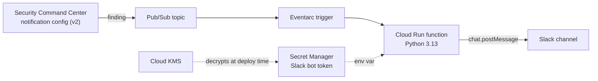

<div align="center">

# 🛡️ Security Command Center findings to Slack

**Real-time Google Cloud Security Command Center alerts in your Slack security channel.**


</div>

Security Command Center (SCC) publishes active, unmuted HIGH and CRITICAL findings to a Pub/Sub topic. A Cloud Run function formats each finding with Slack Block Kit and posts it to your security channel. Everything is deployed with Terraform.

### What a notification looks like

**Exploitable CVE Alert with GTI Vulnerability Intelligence (`CVE-2021-44228` Log4Shell):**

> A new security finding has been identified: [**[WIDE EXPLOIT | CRITICAL IMPACT] CVE-2021-44228 (SOFTWARE_VULNERABILITY)**](#-message-content)
>
> **Project**: example-project-01\
> **Resource**: java-api-prod-01\
> **Severity**: **CRITICAL** 🚨\
> **State**: ACTIVE\
> **Event time**: 2026-09-25T16:50:00.000Z  `[ View in Cloud Console ]`
>
> **CVE**: [CVE-2021-44228](https://nvd.nist.gov/vuln/detail/CVE-2021-44228) | [View Org-Wide in SCC](#)\
> **Exploitability**: **WIDE** | **Impact**: **CRITICAL**\
> **CVSSv3**: `10.0` | **Upstream Fix**: Yes ✅
>
> **🔎 Google Threat Intelligence (GTI) Verdict:**\
> • **GTIG Vulnerability Assessment**: [`CVE-2021-44228`](https://www.virustotal.com/gui/collection/vulnerability--cve-2021-44228) — 🔴 **CRITICAL RISK** (Exploitation: **Wide** | Priority: `P0` | Impact: `Code Execution`)\
> • **Threat Telemetry**: EPSS: `100.00% (100th pct)` | CISA KEV: `Yes`, Ransomware: `Known` | Mitigations: `Patch, Workaround, Intrusion Prevention Signatures, Firewall`\
> • **GTIG Summary**: An Input Validation vulnerability exists that, when exploited, allows a remote attacker to execute arbitrary code. This vulnerability has been confirmed to be widely exploited in the wild...
>
> **Recommendation:**\
> Upgrade package org.apache.logging.log4j:log4j-core to 2.17.1.

**Threat Alert with Google Threat Intelligence (GTI) IoC Enrichment ([Disrupting GRIDTIDE / UNC2814 Demo](https://cloud.google.com/blog/topics/threat-intelligence/disrupting-gridtide-global-espionage-campaign)):**

> A new security finding has been identified: [**Malware: GRIDTIDE Backdoor & SoftEtherVPN C2 (UNC2814)**](#-message-content)
>
> **Project**: telecom-prod-01\
> **Resource**: edge-gateway-01\
> **Severity**: **CRITICAL** 🚨\
> **State**: ACTIVE\
> **Event time**: 2026-09-25T15:45:00.000Z  `[ View in Cloud Console ]`
>
> **🔎 Google Threat Intelligence (GTI) Verdict:**\
> **Campaign Attribution**: [Disrupting GRIDTIDE Global Espionage Campaign (UNC2814)](https://cloud.google.com/blog/topics/threat-intelligence/disrupting-gridtide-global-espionage-campaign)\
> • **IP**: [`130.94.6.228`](https://www.virustotal.com/gui/ip-address/130.94.6.228) — 🔴 **MALICIOUS** (Detections: `12/91` | ASN: `LIGHT NODE LIMITED, VN`)\
> • **Hostname**: [`1cv2f3d5s6a9…free.com`](https://www.virustotal.com/gui/domain/1cv2f3d5s6a9w.ddnsfree.com) — 🔴 **MALICIOUS** (Detections: `15/91`)\
> • **SHA256**: [`ce36a5fc44cb…7c973b47`](https://www.virustotal.com/gui/file/ce36a5fc44cbd7de947130b67be9e732a7b4086fb1df98a5afd724087c973b47) — 🔴 **MALICIOUS** (Detections: `35/76`)\
> • **IP**: [`38.60.194.21`](https://www.virustotal.com/gui/ip-address/38.60.194.21) — 🔴 **MALICIOUS** (Detections: `10/91` | ASN: `LIGHT NODE LIMITED, MY`)
>
> **Explanation:**\
> Detected execution of `/var/tmp/xapt` (GRIDTIDE backdoor) and SoftEtherVPN bridge outbound C2 traffic associated with the UNC2814 / GRIDTIDE global espionage campaign.
>
> **Recommendation:**\
> Isolate the compromised workload immediately, revoke Google Service Account tokens used for Google Sheets C2 exfiltration, and block the C2 IPs and dynamic DNS hostnames.

> [NOTE]
> **Optional Google Threat Intelligence (GTI) Enrichment:** The notifications below showcase our richest configuration with live **Google Threat Intelligence (GTI)** verdicts for both CVEs and IoCs. **GTI enrichment is completely optional**—the solution works out-of-the-box without it. A **GTI API key (`GTI_API_KEY` / `gti_api_key_ciphertext`) is required** if you want to enable the additional threat intelligence enrichment. *If you want to test it, feel free to reach out to me!*

### Quick start

```bash
# 1. Stage 1: KMS key for the Slack bot token
cd infra/kms && cp terraform.tfvars.example terraform.tfvars   # edit
terraform init && terraform apply

# 2. Encrypt the Slack bot token
read -rs SLACK_BOT_TOKEN && export SLACK_BOT_TOKEN
terraform output -raw encrypt_command | sh && unset SLACK_BOT_TOKEN

# 3. Stage 2: the notifier
cd .. && cp terraform.tfvars.example terraform.tfvars          # edit, paste the ciphertext
terraform init && terraform apply
```

See [Deployment](#-deployment) for the full steps and required permissions.

## Contents

- [Features](#-features)
- [Architecture](#-architecture)
- [Repository layout](#-repository-layout)
- [Prerequisites](#-prerequisites)
- [Deployment](#-deployment)
- [Configuration](#-configuration)
- [Message content](#-message-content)
- [Error handling and monitoring](#-error-handling-and-monitoring)
- [Development](#-development)
- [Operations](#-operations)
- [Security considerations](#-security-considerations)
- [Troubleshooting](#-troubleshooting)

## ✨ Features

- **Organization-wide real-time alerts.** Uses the SCC v2 notification API (`google_scc_v2_organization_notification_config`) across the entire GCP organization.
- **High-signal CVE filtering.** Automatically restricts `VULNERABILITY` CVE findings to those with **`WIDE`, `AVAILABLE`, or `CONFIRMED` exploitability** and **`CRITICAL` or `HIGH` impact**, eliminating Slack noise from thousands of unexploited CVEs while preserving all other active `CRITICAL` and `HIGH` findings (`THREAT`, `MISCONFIGURATION`, `TOXIC_COMBINATION`, and non-CVE vulnerabilities).
- **Organization-wide CVE burst deduplication.** Suppresses repeated Slack alerts for the same CVE across all projects in the organization within a configurable cooldown window (`cve_dedup_window_seconds`).
- **Optional Google Threat Intelligence (GTI) enrichment.** When a GTI API key is provided (`gti_api_key_ciphertext` / `GTI_API_KEY`), the function enriches **CVEs** (GTIG risk rating, priority, exploitation state, consequence, EPSS, CISA KEV, mitigations, and executive summary) and **IoCs** (IPs, domains/hostnames, and SHA-256 hashes with detection ratios and campaign context) directly in Slack. Works seamlessly out-of-the-box without a GTI key.
- **Readable messages.** Shows category, project, resource, severity, state, event time, and CVE metadata (Exploitability, Impact, CVSSv3 score, Upstream Fix status, and NVD/Organization-wide SCC links), with a button that opens the finding in the Cloud Console.
- **All finding sources.** Security Health Analytics findings show their explanation and recommendation. Threat detection findings show their description and next steps. Vulnerability findings automatically recommend the fixed package version when available.
- **Optional project allowlist.** By default, alerts cover the entire organization (`allowed_projects = []`), with optional filtering for specific projects.
- **Safe retries.** Transient errors are retried and permanent errors are logged once, so a broken token never causes endless retries.
- **Encrypted secret handling.** The Slack token is committed only as KMS ciphertext (`cryptoKeyEncrypter` / `cryptoKeyDecrypter`) and delivered to the function through Secret Manager.
- **Least privilege.** Separate service accounts for build and runtime, with IAM scoped to the key, secret and function.

## 🏗️ Architecture



Deployment happens in two Terraform stages:

1. **Stage 1** in [infra/kms/](infra/kms/) creates the KMS key that encrypts the Slack bot token.
2. **Stage 2** in [infra/](infra/) creates the topic, SCC notification config, secret, service accounts and function.

## 📁 Repository layout

| Path | Purpose |
|---|---|
| [infra/kms/](infra/kms/) | Stage 1 Terraform: KMS key ring and crypto key. |
| [infra/](infra/) | Stage 2 Terraform: the notifier. |
| [app/scc-finding-slack-notifications/](app/scc-finding-slack-notifications/) | Function source and the Slack Block Kit template. |
| [tests/](tests/) | Unit tests and sample SCC notifications. |

## ✅ Prerequisites

- Terraform 1.9 or newer and the gcloud CLI.
- SCC activated at organization level.
- A Google Cloud project to host the notifier. A dedicated security project is recommended.
- A Slack workspace where you can install apps.

The identity that runs Terraform needs:

| Role | Scope | Why |
|---|---|---|
| `roles/securitycenter.notificationConfigEditor` | Organization | Create the SCC notification config. |
| `roles/pubsub.admin` | Project | Lets SCC grant its service agent publish rights on the topic. |
| `roles/owner`, or equivalent rights to enable APIs and manage IAM, service accounts, functions, secrets and buckets | Project | Deploy the notifier. |
| `roles/iam.serviceAccountUser` | The two service accounts Terraform creates | Deploy the function as those identities. |
| `roles/cloudkms.cryptoKeyDecrypter` | KMS key | Decrypt the token. Stage 1 grants it through `decrypter_members`. |

## 🚀 Deployment

### 1. Create the Slack app

1. Create a Slack app at [api.slack.com/apps](https://api.slack.com/apps) and add the `chat:write` bot token scope.
2. Install it into your workspace and copy the **Bot User OAuth Token**, which starts with `xoxb-`.
3. Invite the bot to the target channel with `/invite @your-app`.
4. Copy the channel ID from the channel details. An ID keeps working when the channel is renamed.

### 2. Create the KMS key

```bash
cd infra/kms
cp terraform.tfvars.example terraform.tfvars   # fill in project_id and members
terraform init
terraform apply
```

The key has `prevent_destroy` set, because destroying it makes the stored ciphertext unrecoverable.

### 3. Encrypt the Slack bot token

Still in `infra/kms`, run the generated `encrypt_command`. This reads the token without echoing it or saving it to shell history:

```bash
read -rs SLACK_BOT_TOKEN && export SLACK_BOT_TOKEN
terraform output -raw encrypt_command | sh
unset SLACK_BOT_TOKEN
```

The output is a single line of base64 ciphertext.

### 4. Deploy the notifier

```bash
cd ../   # infra/
cp terraform.tfvars.example terraform.tfvars
```

Fill in `terraform.tfvars`:

- `org_id` and `project_id`.
- `kms_crypto_key_id` from the stage 1 output `crypto_key_id`.
- `slack_bot_token_ciphertext`. Replace the placeholder `REPLACE-WITH-KMS-CIPHERTEXT-OF-SLACK-BOT-TOKEN` with the ciphertext from step 3. Terraform refuses to plan while the placeholder is still there.
- `slack_channel`, preferably the channel ID.

> [!IMPORTANT]
> The token is encrypted in your Terraform code and variables, but Terraform stores the decrypted token in state. Configure the commented `gcs` backend in [infra/versions.tf](infra/versions.tf) on a bucket with restricted access before the first apply.

Then deploy:

```bash
terraform init
terraform plan
terraform apply
```

### 5. Test end to end

Publish a sample notification to the topic and check the Slack channel:

```bash
gcloud pubsub topics publish scc-findingsnotifier-topic \
  --project=PROJECT_ID \
  --message="$(cat tests/fixtures/sha_private_google_access.json)"
```

For a real finding in your organization, check that the **View in Cloud Console** button opens the finding.

## ⚙️ Configuration

Stage 2 variables are set in `infra/terraform.tfvars`.

<details>
<summary><b>All stage 2 variables</b></summary>

| Variable | Default | Description |
|---|---|---|
| `org_id` | required | Numeric organization ID. |
| `project_id` | required | Project that hosts the notifier. |
| `kms_crypto_key_id` | required | Output `crypto_key_id` of stage 1. |
| `slack_bot_token_ciphertext` | required | Base64 KMS ciphertext of the Slack bot token. |
| `gti_api_key_ciphertext` | `""` (optional) | Optional base64 KMS ciphertext of a Google Threat Intelligence (GTI) API key for CVE and IoC enrichment. Leave empty to run without GTI enrichment. |
| `region` | `europe-west1` | Region for the function, trigger and source bucket. |
| `slack_channel` | `security-gcp-alerts` | Channel ID or name. |
| `notification_filter` | see below | Organization-wide SCC findings filter (includes CVE exploitability & impact rules). |
| `allowed_projects` | `[]` | Project IDs or display names to notify for. Empty means the entire organization. |
| `allowed_exploitability` | `["WIDE", "AVAILABLE", "CONFIRMED"]` | Allowed CVE `exploitationActivity` values for vulnerability alerts. |
| `allowed_cve_impact` | `["CRITICAL", "HIGH"]` | Allowed CVE `impact` ratings for vulnerability alerts. |
| `cve_dedup_window_seconds` | `3600` | Organization-wide cooldown window (seconds) to deduplicate repeated alerts for the same CVE. |
| `notification_config_id` | `scc-slack-notifier` | ID of the SCC notification config. |
| `topic_name` | `scc-findingsnotifier-topic` | Pub/Sub topic name. |
| `pubsub_allowed_persistence_regions` | `["europe-west1", "europe-west4"]` | Where Pub/Sub may store messages. |
| `secret_replica_locations` | `["europe-west1", "europe-west3"]` | Secret Manager replica locations. |
| `function_name` | `scc-slack-notifier` | Function name. |
| `function_runtime` | `python313` | Python runtime. |
| `max_instance_count` | `3` | Maximum function instances. Keep low to respect Slack rate limits. |
| `max_event_age_seconds` | `3600` | Events older than this are dropped instead of retried. |

</details>

Stage 1 variables are described in [infra/kms/variables.tf](infra/kms/variables.tf).

### Filtering findings

The default filter sends active, unmuted HIGH and CRITICAL findings across the organization, while restricting CVE `VULNERABILITY` findings to those with `WIDE`, `AVAILABLE`, or `CONFIRMED` exploitability and `CRITICAL` or `HIGH` impact:

```
(severity="HIGH" OR severity="CRITICAL") AND state="ACTIVE" AND -mute="MUTED" AND (finding_class!="VULNERABILITY" OR vulnerability.cve.id="" OR ((vulnerability.cve.exploitation_activity="WIDE" OR vulnerability.cve.exploitation_activity="AVAILABLE" OR vulnerability.cve.exploitation_activity="CONFIRMED") AND (vulnerability.cve.impact="CRITICAL" OR vulnerability.cve.impact="HIGH")))
```

The filter uses the same syntax as the SCC `findings.list` method. Always put parentheses around `OR` groups. Examples:

```
category="OPEN_FIREWALL" AND state="ACTIVE"
state="ACTIVE" AND -parent="organizations/ORG_ID/sources/SOURCE_ID"
```

The Cloud Run function also deduplicates repeated alerts for the same CVE across the organization within `cve_dedup_window_seconds` (default `3600` seconds). To notify only for specific projects, set `allowed_projects` (empty means the entire organization).

> [!WARNING]
> Create the notification config only through Terraform. A second config created with `gcloud scc notifications create` makes every finding post twice. Configs made with the v1 API are not visible in the v2 API, so find and delete old ones:
>
> ```bash
> gcloud scc notifications list --organization=ORG_ID
> gcloud scc notifications delete OLD_CONFIG_ID --organization=ORG_ID
> ```

## 💬 Message content

Each message contains:

- A link to the finding with its category.
- The project, resource, severity, state and event time.
- A **View in Cloud Console** button.
- CVE details (NVD link, organization-wide SCC link, Exploitability, Impact, CVSSv3 score, and Upstream Fix status) when the finding includes a CVE.
- **Optional Google Threat Intelligence (GTI) Verdict** for CVEs and IoCs when `GTI_API_KEY` is configured (automatically omitted when no GTI API key is set).
- Explanation and recommendation. Security Health Analytics provides these in `sourceProperties`. Threat detection findings use `description` and `nextSteps`.
- Exception instructions, when the finding provides them.

Sections without content are left out. Long sections are cut at Slack's 3000 character limit. CRITICAL findings get a `:rotating_light:` emoji and HIGH findings get `:warning:`.

To change the layout, edit [finding-detail.json](app/scc-finding-slack-notifications/block_templates/finding-detail.json). The available placeholders are listed in `PLACEHOLDER_KEYS` in [main.py](app/scc-finding-slack-notifications/main.py).

## 📈 Error handling and monitoring

| Error type | Examples | Behaviour |
|---|---|---|
| Transient | Network failure, HTTP 429 or 5xx, Slack `ratelimited` or `internal_error` | Logged as WARNING and retried by Eventarc. |
| Permanent | `invalid_auth`, `channel_not_found`, `not_in_channel`, `invalid_blocks`, undecodable message | Logged as ERROR and not retried. |
| Too old | Event older than `max_event_age_seconds` | Logged as ERROR and dropped. |

Create a log-based alert on this query to catch permanent failures:

```
resource.type="cloud_run_revision"
resource.labels.service_name="scc-slack-notifier"
severity>=ERROR
```

Replace `scc-slack-notifier` if you changed `function_name`.

## 🧪 Development

Set up a virtual environment and run the tests:

```bash
python3 -m venv .venv && . .venv/bin/activate
pip install -r app/scc-finding-slack-notifications/requirements.txt pytest
pytest
```

Preview the Slack blocks for a sample notification without sending anything. The script works **without** a GTI API key (standard SCC + CVE output) or **with** `GTI_API_KEY` to include live **Google Threat Intelligence (GTI)** enrichment for **Log4Shell (`CVE-2021-44228`)** and the **[UNC2814 / GRIDTIDE Global Espionage Campaign](https://cloud.google.com/blog/topics/threat-intelligence/disrupting-gridtide-global-espionage-campaign)** *(Note: a GTI API key is required for the additional enrichment—if you want to test it, feel free to reach out to me)*:

```bash
# Run without GTI enrichment (works out-of-the-box without any API key):
python3 app/scc-finding-slack-notifications/main.py tests/fixtures/vuln_v2_log4shell_cve_2021_44228.json

# 1. Test Log4Shell (CVE-2021-44228) with live GTI CVE Risk, Priority (P0), Impact, EPSS & CISA KEV:
GTI_API_KEY=your_gti_api_key python3 app/scc-finding-slack-notifications/main.py tests/fixtures/vuln_v2_log4shell_cve_2021_44228.json

# 2. Test UNC2814 / GRIDTIDE Espionage Campaign IoCs (IPs, Hostnames, SHA-256) with live GTI verdicts:
GTI_API_KEY=your_gti_api_key python3 app/scc-finding-slack-notifications/main.py tests/fixtures/etd_v2_gridtide_espionage.json
```

Add `--send` to post the message to Slack, using `SLACK_BOT_TOKEN` and `SLACK_CHANNEL` from your environment. Validate Terraform changes with:

```bash
terraform -chdir=infra fmt -check -recursive
terraform -chdir=infra init -backend=false && terraform -chdir=infra validate
```

## 🔧 Operations

### Rotating the Slack token

1. Encrypt the new token as in [step 3](#3-encrypt-the-slack-bot-token).
2. Update `slack_bot_token_ciphertext` and run `terraform apply`.
3. The function reads the `latest` secret version when an instance starts. Redeploy the function to pick up the new token immediately.

### Updating the function

Any change to the source code changes the zip hash, so `terraform apply` rebuilds and redeploys the function.

## 🔐 Security considerations

- **The token is encrypted in the Terraform code.** The repository and `terraform.tfvars` hold only KMS ciphertext. Only identities with `cryptoKeyDecrypter` on the key can decrypt it.
- **Terraform state still holds the plaintext token.** Terraform decrypts the ciphertext during apply and saves the result in state. Saved plan files from `terraform plan -out` contain it too. Use a remote backend with restricted access, and treat saved plan files as secrets.
- **The function is internal only.** Ingress is `ALLOW_INTERNAL_ONLY`, and only the trigger service account may invoke it.
- **Findings may be sensitive.** Post them to a private channel with a limited audience.

## 🩺 Troubleshooting

<details>
<summary><b>Common problems and fixes</b></summary>

| Symptom | Likely cause | Fix |
|---|---|---|
| `Invalid value for variable` on plan | The token placeholder is still in `terraform.tfvars`. | Replace it with the ciphertext from step 3. |
| `PERMISSION_DENIED` on `google_kms_secret` | The Terraform identity cannot decrypt. | Add it to `decrypter_members` in stage 1 and apply. |
| `PERMISSION_DENIED` creating the notification config | Missing organization role. | Grant `roles/securitycenter.notificationConfigEditor` on the organization. |
| Log shows `not_in_channel` | The bot is not a channel member. | Run `/invite @your-app` in the channel. |
| Log shows `channel_not_found` | Wrong channel name or ID. | Use the channel ID from the channel details. |
| Log shows `invalid_auth` | The token is wrong or revoked. | Rotate the token. |
| Every finding posts twice | A second notification config exists. | Delete the extra config, see [Filtering findings](#filtering-findings). |
| No messages at all | The filter matches nothing, or SCC is not activated for the organization. | Test with the Pub/Sub publish command in step 5, then relax the filter. |

</details>
